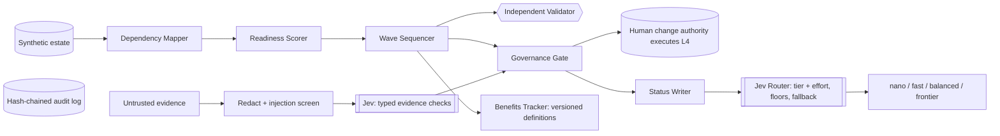

# SunsetIQ — governed legacy-application retirement planning with a decision-model routing layer


**Dependency-aware application rationalisation · technical-debt decommissioning · LangGraph multi-agent pipeline · human-in-the-loop
autonomy ladder · tamper-evident audit log · claimed-vs-verified savings · LLM model routing (Jev / System One decision model) ·
cost-accuracy-speed trade-offs · DMAIC + Agile delivery.** Synthetic, fully anonymized data; no real organisation modelled.

Retiring legacy systems is where the savings are, and where the damage is. Retire an application before its consumers have
moved and something breaks, the "saving" is reversed, and the programme report still counts it as delivered. SunsetIQ plans
retirements so nothing is orphaned, keeps a human accountable for every irreversible step, and reports savings under definitions
that cannot silently change.

## See it in action
`python scripts/run_demo.py` — real output from a seeded run (illustrative currency, mock models):

```
Estate: 200 apps, 276 dependency links, 93 retire candidates

                              naive cost-first    governed
orphaned dependency links                  108           0
rollbacks                                   42           0
change-freeze violations                     4           0
waves (incl. rework)                        30          21
  naive:    claimed 34.95M run-rate | verified net year-one  2.49M
  governed: claimed 34.95M run-rate | verified net year-one 19.35M

Governance (every decommission needs a human): 24 pack-ready · 35 human review · 34 blocked
Audit chain intact: True (235 entries)
```

## Architecture

**Code before models:** mapping, scoring, sequencing, validation, policy and benefit arithmetic are deterministic. Models are used only for
language tasks, and a decision model (TypeSafe's Jev — mocked here) judges typed questions and picks a model + effort per task.

## What's inside
- **Dependency-aware sequencer** with cut-over groups (mutually dependent apps retire together), change-freeze windows, renewal-date urgency, and an **independent validator** that re-checks every plan from scratch.
- **Autonomy ladder L0–L4; no agent is ever granted L4.** Policy engine adds service-owner, DPO and Change Authority Board sign-offs.
- **Evidence gate** that redacts, screens for prompt injection, asks typed questions, and **fails closed**.
- **Jev layer:** rules-over-model tier floors, include/exclude pools, cache-aware stickiness, confidence escalation, and *our own* fallback (the hosted router product fails the request if the decision model times out).
- **Benefits tracker** with hashed, versioned definitions: claimed vs verified.
- **Evaluation + ROI** with confidence intervals and a labelled-assumptions ROI model.
- Full programme docs: charter, SIPOC, CTQ, RACI, RAID, ADKAR, three gated releases — see `docs/`.

## Honest evaluation
- **69 tests** pass; held-out sets were written after the logic was frozen and run once.
- **Routing (held-out, n = 24, mock decision model):** all-frontier 100% at $61.00 per 1,000 tasks; floors-routed 71% (51–85) at $5.59; static rules 67% at $5.27; no floors 21%. **Floors do most of the work; the mock adds little over static rules** — a real decision model is untested here.
- **Evidence gate (held-out, 22 packs):** 0 false approvals, but also 0 approvals of genuinely supported packs — it fails safe and approves nothing on paraphrased wording.
- **Governed is slower and misses more licence renewals** (13.14M vs 5.17M); ROI is **marginal (1.07×) at a 50% incident rate and break-even at 47%**.
- **Flaws found and fixed during the build** are documented in `docs/eval-report.md` (e.g. cache-stickiness locking 93 independent tasks onto one model).
- **Limits:** synthetic data, mocked models, simulated accuracy, illustrative prices; the real Jev adapter is an unverified skeleton.

## Cost, accuracy, speed
See `docs/model-selection.md` for the tier table, the profile comparison and when *not* to use a router. ROI: `docs/roi.md`.

## Quick start
```bash
pip install -r requirements.txt
python -m pytest -q tests          # 69 tests
python scripts/run_demo.py         # the block above
python scripts/run_all_eval.py     # writes eval/results/results.json
```

## Series
TrueResolve measures the metric honestly → SentinelCX governs autonomous action → FirstLine improves the underlying operation →
ClearCount audits whether claimed numbers hold up → **SunsetIQ runs the transformation itself: sequencing, approving and verifying the savings.**
