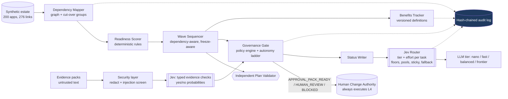

# Architecture

**Principle: code before models.** Mapping, scoring, sequencing, validation, policy and benefit arithmetic are
deterministic Python. Models appear only where language is involved (drafting change requests, impact summaries,
status packs), and Jev appears in two places: judging typed questions about untrusted evidence, and choosing which
model and effort a language task deserves.

## Components
| Module | Role | Model call? |
|---|---|---|
| `data_gen.py` | Deterministic synthetic estate (invented names, costs, links, renewal waves) | No |
| `graph.py` | Dependency graph, blast radius, strongly connected "cut-over groups" | No |
| `readiness.py` | Explainable 0–100 readiness score with factor breakdown | No |
| `sequencer.py` | Naive and governed planners, independent validator, metrics, renewal lower bound | No |
| `policy.py` | Autonomy ladder, decommission policy, evidence gate (fails closed) | Jev (typed judge) |
| `security.py` | PII/secret redaction, prompt-injection screening | No |
| `audit.py` | Hash-chained tamper-evident log | No |
| `jev_layer/` | Catalogue, `MockJevClient`, unverified real adapter, router | Jev (routing) |
| `benefits.py` | Claimed vs verified savings under hashed, versioned definitions | No |
| `roi.py`, `routing_eval.py`, `gate_eval.py` | Evaluation and economics | No |
| `pipeline.py` | LangGraph orchestration: map → score → sequence → govern → report | Via router |

## Key design decisions
1. **Independent validator.** `validate_plan` re-derives every invariant from the plan alone and shares no logic with the
   planner, so a planner bug cannot hide itself.
2. **Cut-over groups.** Mutually dependent apps (strongly connected components) retire together, never one by one.
3. **No agent ever holds L4.** A decommission is executed by a human change authority; agents prepare approval packs.
4. **Rules over model.** Per-task-type tier floors beat whatever the decision model suggests; regulated work is
   floored at the balanced tier.
5. **Own fallback.** If the decision model fails or times out the router degrades to the floor tier; the evidence gate
   fails closed to human review. (The hosted router product fails the request instead.)
6. **Vendor allow-list in code.** Only US-headquartered vendors are admitted; anything else raises at import time.
